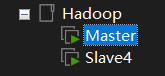
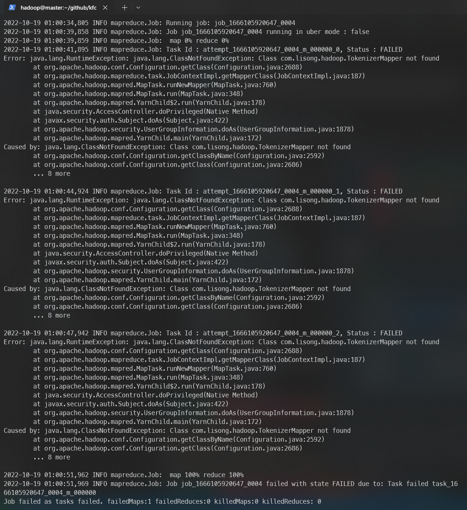
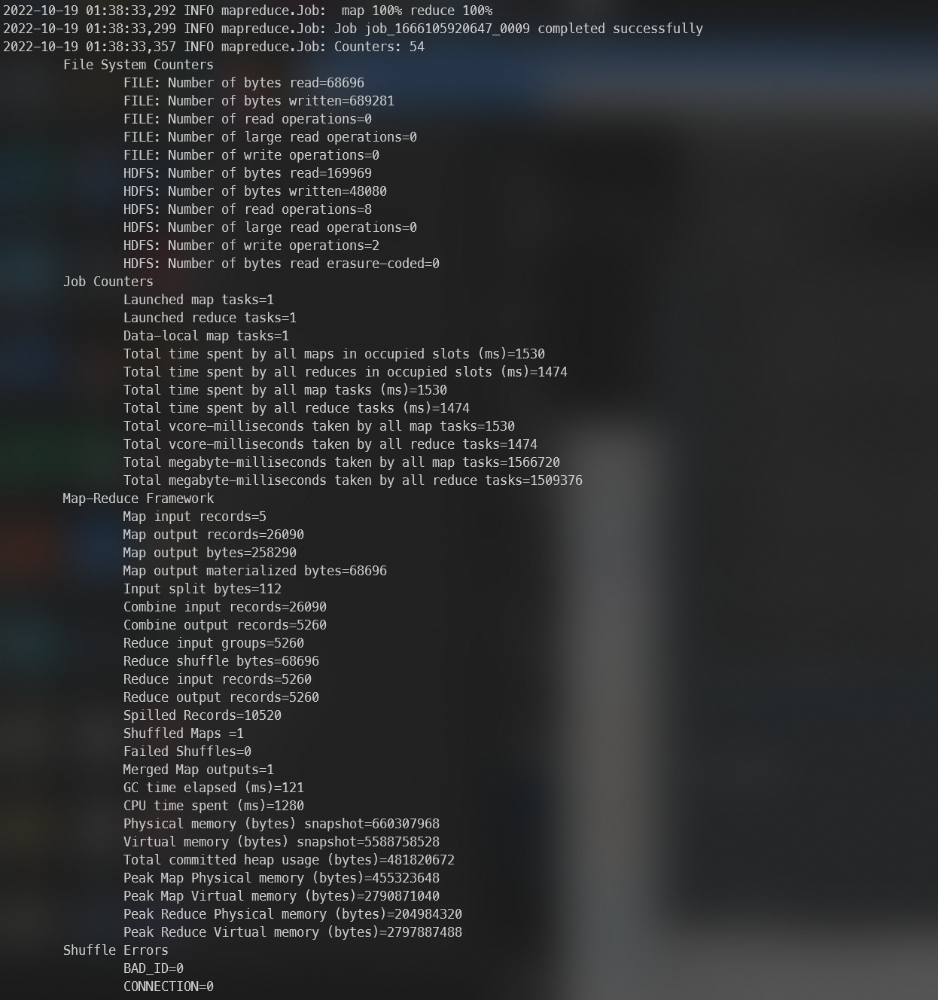
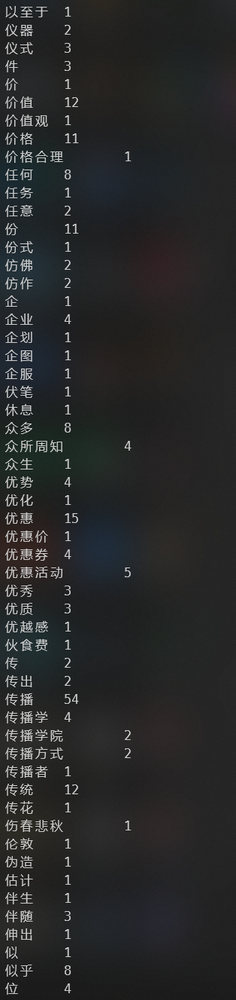

# 工作流程

## 准备部分
1. 由于要进行收集的资料是关于 “肯德基“ 和 ”疯狂星期四“ 的，构建的大概工作流程是先使用搜索引擎对关键词进行搜索，再使用 `selenium` 进行模拟浏览器控制， `lxml` 来解析页面的 `html` ， 从而收集到想要的文件资料。
2. 确定了技术选型之后选择采用 `json` 格式来储存资料。

## 实现部分
1. 安装了 `selenium`，`lxml` 以及所需要的工具，例如 `chromedriver` 。
2. 按照准备好的方式，使用 google 新闻搜索”KFC“ + “疯狂星期四”两个关键词，再对搜索结果顺序访问，提取`html`中的文字信息。
3. 使用 `json` 格式化输出。

## 修改部分
1. 发现有些页面存在页眉页脚以及联系方式等无关内容，进行删除。
2. 删除了一些无意义的字符，例如 `\n` ， `&nbsp` 等。
3. 对于搜索到的与 “肯德基” 、 “疯狂星期四” 无关的文章进行了筛选。

## ligen131 工作流程

按照教程配置虚拟机和 Hadoop 集群。

安装 CentOS 7 虚拟机 -> 联网 -> 安装 JDK -> 安装 Hadoop 并配置 -> 启动 Hadoop 集群

中间出现了意料之外的一些错误，找了一些资料，后来才知道 Namenode(master) 和 Datanode(slave) 是分开运行。

本来 master 节点应该可以控制并自动开启 slave 节点，但是在实际中开启 master 的 hadoop 之后 slave 并不会自动开启。于是手动启动 slave 暂时解决这个问题。

设备信息：


原本配置了一共四台虚拟机，每台规格相同：2 核 * 2 处理器 2GB 内存 20GB 硬盘，后来由于 slave 无法自动启动问题，仅配置了一台 master 和一台 slave




wordcount 代码参考 <https://songlee24.github.io/2015/07/29/mapreduce-word-count/>

用 Python `jieba` 库进行中文分词并输出：

```python
# coding:utf-8

from os import path
import sys
import jieba

ExcludeWord = [ ]

def word_segment(text):
  jieba_word = jieba.cut(text, cut_all = False)
  seg_list = ' '.join(jieba_word)
  open("wordcount/input/jieba_result.txt", "w", encoding = 'UTF8').write(seg_list)
  return seg_list

if __name__=='__main__':
  _file = "wordcount/input/KFCDataSet.txt"
  text = open(_file, encoding = 'UTF8').read()
  for x in ExcludeWord:
    text = text.replace(x, " ")
  text = word_segment(text)
```

构建脚本，自动化编译代码、调用 Hadoop 集群。

```shell
cd wordcount
javac -classpath $HADOOP_HOME/share/hadoop/common/hadoop-common-3.3.4.jar:$HADOOP_HOME/share/hadoop/mapreduce/hadoop-mapreduce-client-core-3.3.4.jar:$HADOOP_HOME/share/hadoop/common/lib/commons-cli-1.2.jar -d classes/ src/*.java
jar -cvf WordCount.jar classes
hadoop fs -rm -f /hbase/input/*
hadoop fs -put input/jieba_result.txt /hbase/input/
hadoop fs -rm -f -r /hbase/output/
hadoop jar WordCount.jar com.lisong.hadoop.WordCount /hbase/input /hbase/output
```

期间遇到一些错误，加上 `job.setJar("WordCount.jar");` 解决。



Hadoop 结果：



跑集群的过程中 CPU 短暂的峰值利用率：


词频统计结果：



（位于 `hadoop_result.txt`）

用 Python `wordcloud` 库生成词云。~~其实 `wordcloud` 生成词云根本就不用跑前面的词频结果（这句不要写进 ppt 里）~~ 

发现有很多没有必要的介词等出现次数过多，影响了词云的生成，所以添加了排除列表：

```python
ExcludeWord = ['我', '你', '了', '的', '是', '吧', '吗', '在', '不', '都', '就', 
               '没', '有', '也', '又', '他', '她', '们', '和', '为', '到', '还',
               '但', '被', '会', '这', '并', '一个', '能', '个', '要', '而']
```

最后的词云结果：


